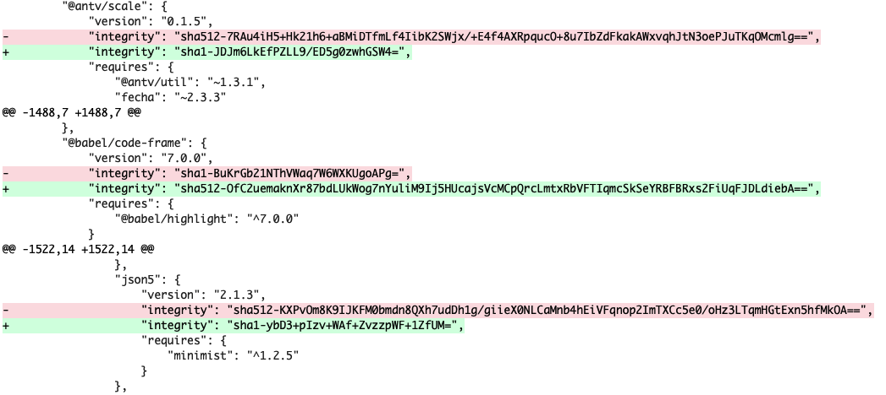
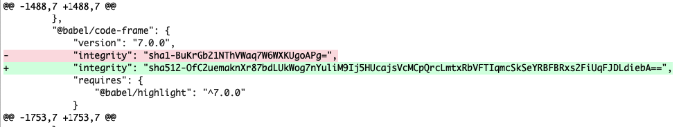

<div align="center"><pre>
  _               _    _____ _      
 | |    ___   ___| | _|  ___(_)_  __
 | |   / _ \ / __| |/ / |_  | \ \/ /
 | |__| (_) | (__|   <|  _| | |>  < 
 |_____\___/ \___|_|\_\_|   |_/_/\_\
</pre></div>

[lockfix](https://github.com/kopach/lockfix)

<div align="center">

[](https://snyk.io/test/github/kopach/lockfix)
[](https://codeclimate.com/github/kopach/lockfix/maintainability)
[](https://lgtm.com/projects/g/kopach/lockfix/context:javascript)

[](https://www.npmjs.com/package/lockfix)

</div>

⭐️ Please, star me on GitHub — it helps!

[lockfix](https://github.com/kopach/lockfix) – is a [git](https://git-scm.com/) based CLI tool, which helps to revert `sha1` integrity changes of npm lock file

<h1 align="center">

Before


After


</h1>

## 🧬 Table of Contents

- [❓ Why?](#-why-)
- [✨ Features](#-features-)
- [💾 Install](#-install-)
- [🔨 Usage](#-usage-)
- [📄 License](#-license-)

## ❓ Why? [🔝](#-table-of-contents)

[NPM](https://npmjs.org/) has known issue of constantly changing `integity` property of its lock file. Integrity may change due to plenty of reasons. Some of them are:

- `npm install` done on machine with different OS from one where lock file generated
- some package version updated
- another version of `npm` used

Intention of this tool is to prevent such changes and make `integrity` property secure and reliable.

## ✨ Features [🔝](#-table-of-contents)

- Reverts changes from `sha512` to `sha1`. Keeps untouched changes from `sha1` to `sha512`. `sha512` algorithm is more secure.
- Works well with both `package-lock.json` and `npm-shrinkwrap.json`

## 💾 Install [🔝](#-table-of-contents)

Install per project with [NPM](https://npmjs.org/)

```bash
npm install --save-dev lockfix
```

or to install globally

```bash
npm install -g lockfix
```

## 🔨 Usage [🔝](#-table-of-contents)

### Add to `package.json`

```json
"scripts": {
    "postshrinkwrap": "lockfix",
},
```

### Manually from terminal

```bash
lockfix
```

or (without install)

```bash
npx lockfix
```

## 📄 License [🔝](#-table-of-contents)

This software licensed under the [MIT](https://github.com/kopach/lockfix/blob/master/LICENSE)
